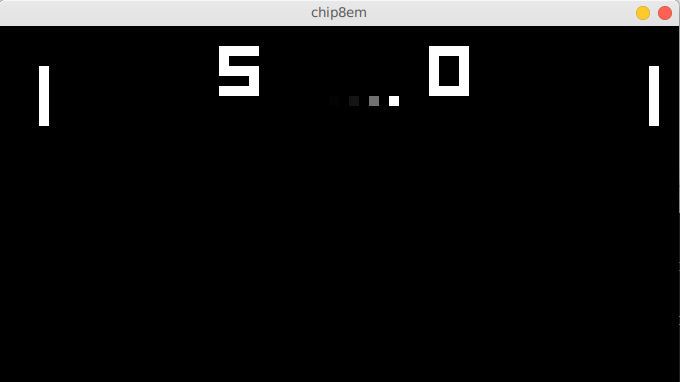

# chip8em

CHIP-8 interpreter

## How to build

If you don't have a version of clang that supports C++20, edit the `Makefile` and replace `CXX = clang++` with your favorite C++20 compiler. You'll also need to ensure that SDL2 is installed. Then type `make`.

Play a CHIP-8 rom with `./chip8em romfile`. Sound is not yet supported.

## Notes

The timing is not yet accurate, but screen ghosting is emulated in order to reduce flicker on certain roms.